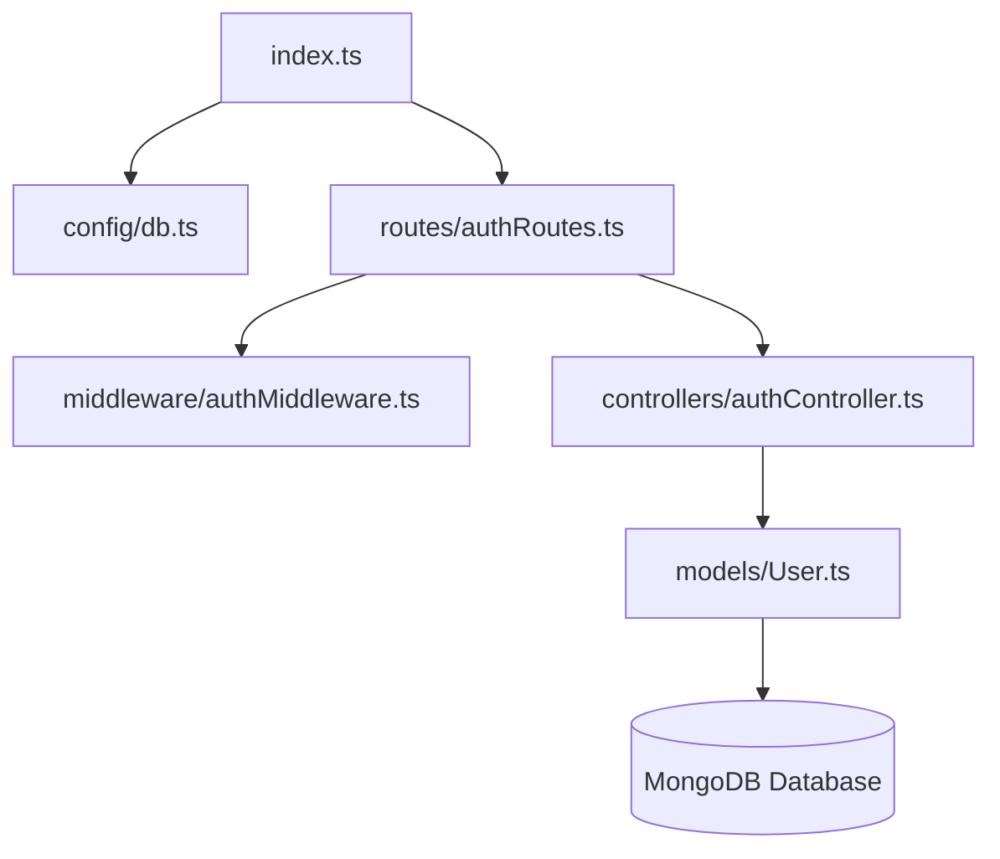
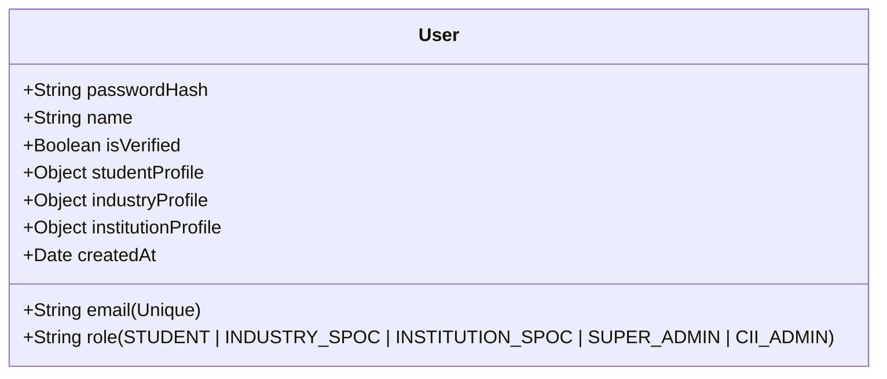
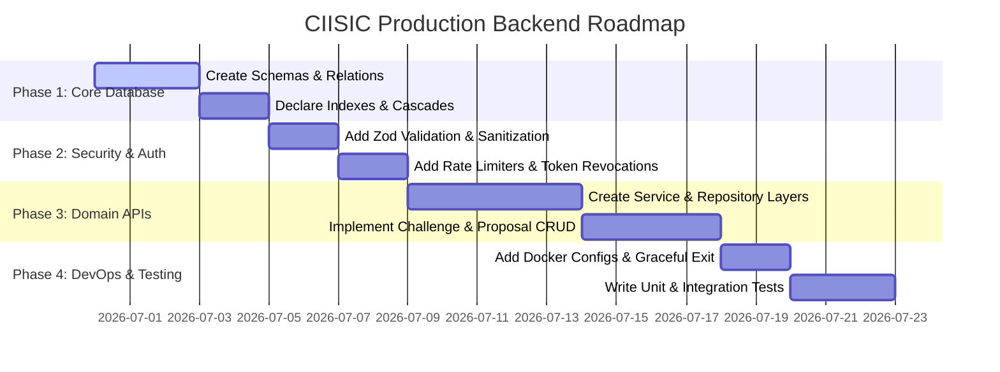

# CIISIC Enterprise Backend Audit & Production Readiness Report

This report evaluates the current `backend/` codebase to assess its compliance, security, database structure, and devops readiness for state-scale deployment serving 100,000+ active students, universities, company SPOCs, and reviewers.

---

## 1. Repository Audit & Folder Structure

The current backend is a minimal Node.js Express API scaffold written in TypeScript. 

### Folder Dependency Graph

### File-by-File Audit
* **[index.ts](file:///Users/maddy/saasable-ui/backend/src/index.ts)**: Configures global Express app. Integrates basic security middleware (cors, helmet, cookie-parser). Maps the authentication endpoint `/api/v1/auth`.
* **[db.ts](file:///Users/maddy/saasable-ui/backend/src/config/db.ts)**: Simple Mongoose connector block using default environment connections.
* **[User.ts](file:///Users/maddy/saasable-ui/backend/src/models/User.ts)**: Single User model containing student, industry, and institutional embedded profile objects.
* **[authController.ts](file:///Users/maddy/saasable-ui/backend/src/controllers/authController.ts)**: Implements register, login, refresh, and getMe handlers.
* **[authMiddleware.ts](file:///Users/maddy/saasable-ui/backend/src/middleware/authMiddleware.ts)**: Decodes Bearer tokens and validates role-based permissions lists.
* **[authRoutes.ts](file:///Users/maddy/saasable-ui/backend/src/routes/authRoutes.ts)**: Declares routing lines for registration, logging, and state verification.

---

## 2. Architecture Audit

### Current Architectural Style: Mixed MVC Scaffold
The codebase is currently structured as a flat Model-View-Controller (MVC) API. 
* **Strengths**:
  * Very easy to navigate and trace route calls.
  * TypeScript interfaces match database schemas.
* **Weaknesses & Scale Risks**:
  * **No Repository Layer**: Controller blocks query the Mongoose models directly. This couples business operations to the database driver.
  * **No Service Layer**: Password hashing, JWT creation, and validation exist directly inside `authController.ts`.
  * **Lack of Abstraction**: No Dependency Injection (DI). Hard to write unit tests or swap libraries (e.g. replacing Bcrypt with Argon2).

---

## 3. Database Audit

### Schema: The User Model ([User.ts](file:///Users/maddy/saasable-ui/backend/src/models/User.ts))
Currently, there is only one collection (`User`).

### Critical Database Debt
1. **Missing Indexes**: Except for the unique index on `email`, no indexes are declared on sub-document fields (e.g., `studentProfile.enrollmentNo` or `industryProfile.companyName`), causing full collection scans as the database grows.
2. **Missing Collections**: Challenges, Proposals, Evaluations, Audit Logs, and Excellence Cells are not represented in the database at all. They must be created as first-class schemas.
3. **No Cascade/Soft Delete Strategy**: No soft-delete logic or lifecycle hooks are present to prevent orphaned records if a user is suspended.

---

## 4. Authentication & Security Audit

### Current Authentication Flow
* JWT access tokens expire in 15 minutes.
* Refresh tokens are stored in `HttpOnly` cookies (valid for 7 days).

### Security Weaknesses
> [!WARNING]
> **Weak JWT Secret Fallbacks**: `authController.ts` uses static fallback secrets (`ciisic-secret-key-12345`) if environment variables are missing. This opens the system to trivial signatures spoofing.
>
> **Missing Token Revocation**: No blacklist/whitelist database table exists. If a user changes their password, old refresh tokens remain valid until expiration.
>
> **Missing Rate Limiting**: The `/api/v1/auth/login` endpoint does not use rate limiting. It is highly vulnerable to brute-force credential stuffing.
>
> **Cookie Flags in Local Dev**: Cookies do not enforce `secure: true` in local development environments.

---

## 5. API Endpoint Analysis

Currently, only 4 endpoints exist:

| Method | Route | Purpose | Authentication | Authorization | Custom Validation |
| :--- | :--- | :--- | :--- | :--- | :--- |
| `POST` | `/api/v1/auth/register` | Register a new user | Public | None | None |
| `POST` | `/api/v1/auth/login` | Authenticate user | Public | None | None |
| `POST` | `/api/v1/auth/refresh` | Rotate access token | Public | None | None |
| `GET` | `/api/v1/auth/me` | Fetch active user profile | Bearer Token | Any | None |

### Missing API Endpoints
* No endpoints to create/approve challenges, submit proposals, assign reviewers, publish excellence cells, or view logs.
* No CRUD endpoints to manage university SPOC registrations or list students.

---

## 6. Code Quality & Validation Audit

* **Magic Strings**: Static values like token lifespans (`15m`, `7d`) are hardcoded.
* **No Input Sanitization**: No request validation framework (like Zod or Joi) is used to sanitize incoming payloads. This exposes the database to NoSQL injection and XSS payloads.
* **Missing Global Error Handler**: Express router errors trigger standard stack trace disclosures to consumers instead of structured, clean JSON responses.

---

## 7. File Upload Audit
* There is no file upload controller or storage handler (e.g., local disk multer or S3 streams). 
* Future uploads (PDF proposals, company verification credentials) require validation, size caps, and virus scanning integrations (e.g., ClamAV).

---

## 8. Performance & DevOps Audit

* **No Connection Pooling Configuration**: Uses default Mongoose settings which can saturate database connections under load.
* **No Process Manager**: The server runs via standard node execution instead of PM2 or Docker.
* **Graceful Shutdown Missing**: No listener catches `SIGTERM` or `SIGINT` to flush pending DB queries before terminating processes.

---

## 9. OWASP Risk & Security Scorecard

| OWASP Risk Category | Current Status | Score (1-10) |
| :--- | :--- | :---: |
| **Broken Authentication** | Lack of rate limiting, token revocations, and MFA. | **3/10** |
| **Broken Authorization** | Basic roles list check exists, but lacks database permission matrix sync. | **4/10** |
| **Insecure File Uploads** | Non-existent, no validation policies. | **0/10** |
| **Injection Risks** | Input parameters pass directly into Mongoose queries with zero sanitization. | **2/10** |
| **Security Misconfiguration** | Static fallback secrets allowed, verbose stack traces exposed. | **3/10** |

### **Overall Security Score: 2.4 / 10**

---

## 10. Production Readiness Assessment

* **Architecture**: **3/10** (Flat controllers lack service and repository layers)
* **Database**: **2/10** (Only one collection, no indexes, missing schemas)
* **Security**: **2/10** (Lacks token revocation, rate limiting, and sanitizers)
* **API Compliance**: **2/10** (Only auth endpoints created)
* **DevOps & Monitoring**: **2/10** (No Docker files, PM2, or graceful shutdowns)

### **Ecosystem Readiness: 2.2 / 10**

---

## 11. Technical Debt Prioritized Action Plan

| Priority | Issue | Impact | Recommended Fix | Complexity |
| :--- | :---: | :--- | :--- | :---: |
| **Critical** | Missing schemas (Challenges, Proposals, Logs) | Blocks all core ecosystem features. | Build Mongoose schemas for all entities. | Medium |
| **Critical** | Hardcoded JWT secret keys fallbacks | Signature forgery. | Enforce process check to crash if env keys are missing. | Low |
| **High** | Lack of Request Validation | Database injection. | Add Zod middleware validation on all POST/PUT routes. | Medium |
| **High** | No Rate Limiting | Brute force login locks. | Add `express-rate-limit` to auth controllers. | Low |
| **Medium** | MVC Controller Coupling | Hard to unit test. | Extract database logic to repositories and services. | High |

---

## 12. Enterprise Production Migration Roadmap

This roadmap details the systematic progression to convert the current scaffold into an enterprise-grade backend.

### Execution Phases
1. **Phase 1: Core Database Refactoring**: Write Mongoose schemas for `Challenge`, `Proposal`, `ExcellenceCell`, `AuditLog`, and `Evaluation`. Add compound indexes on keys like `studentProfile.enrollmentNo` and `challengeId`.
2. **Phase 2: Strict Security Audit Remediations**: Inject Zod request schema validation middleware. Add rate limiters to logging paths and block fallback JWT secrets.
3. **Phase 3: Domain Service Layer Architecture**: Refactor controllers to isolate business rules inside services and data operations inside repositories.
4. **Phase 4: Dockerization & DevOps Prep**: Create Dockerfiles, configure PM2 process managers, and add graceful process termination listeners.
