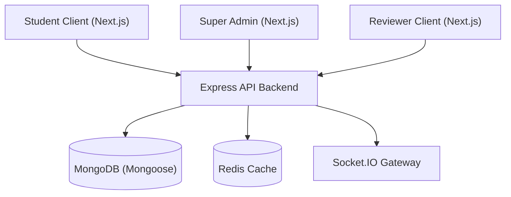

# CIISIC Systems Architecture & Development Onboarding Guide

This document acts as the technical systems manual and ER diagrams overview for Version 1.0.

---

## 1. System Components Architecture

---

## 2. Database Collection Schemas

The following Mongoose models govern the core platform data entities:
* **User**: Holds login credentials (emails, hashed passwords), user role flags (`STUDENT`, `SUPER_ADMIN`, `INDUSTRY_SPOC`, `INSTITUTION_SPOC`, `REVIEWER`), and verified indicators.
* **Challenge**: Represents industry projects containing skill keywords, deadlines, templates, and company tags.
* **Proposal**: Connects solution abstract summaries, files uploads, and status parameters back to the solver's profile.
* **Review**: Scorecards containing innovation, technical feasibility, scalability, documentation, and business impact averages.
* **AuditLog**: Immutable logs capturing actions (logins, uploads, reviews, page updates) for security tracing.
* **CMSPage**: Stores customizable layouts and FAQ elements.

---

## 3. Role-Based Access Controls (RBAC Matrix)

| Resource | Student | Reviewer | Inst. SPOC | Ind. SPOC | Super Admin |
| :--- | :---: | :---: | :---: | :---: | :---: |
| Submissions | Read/Write | Read | Read | Read | Read/Delete |
| Evaluations | - | Read/Write | Read | Read | Read/Delete |
| Challenges | Read | Read | Read | Read/Write | Read/Write |
| Users list | - | - | Read | - | Read/Write |
| Audit Trail | - | - | - | - | Read |
